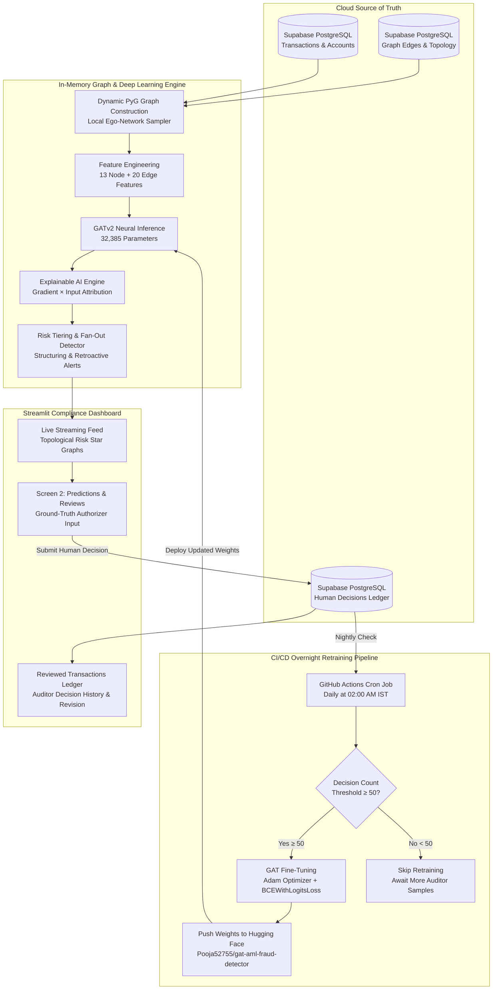

# AML Real-Streaming Transaction Monitoring & Graph Neural Network Engine 🛡️

[](https://streamlit.io/)
[](https://pytorch-geometric.readthedocs.io/)
[](https://huggingface.co/Pooja52755/gat-aml-fraud-detector)
[](https://supabase.com/)
[](https://github.com/features/actions)

An enterprise-grade Anti-Money Laundering (AML) transaction monitoring, graph investigation, and human-in-the-loop retraining platform. Powered by **PyTorch Geometric (PyG) Graph Attention Networks (GATv2)**, **Supabase PostgreSQL Cloud Storage**, dynamic **NetworkX ego-network visualizers**, and an automated **GitHub Actions CI/CD overnight retraining pipeline** synchronized directly with **Hugging Face Hub**.

---

## 📌 Target Architecture & System Workflow



---

## 💻 Complete Technology Stack

| Layer | Technology | Key Libraries / Services | Purpose |
| :--- | :--- | :--- | :--- |
| **Deep Learning & GNN** | PyTorch & PyG | `torch`, `torch_geometric`, `GATv2Conv` | Multi-head attention inference on dynamic transaction multigraphs. |
| **Model Registry & Hub** | Hugging Face | `huggingface_hub` (`HfApi`, `hf_hub_download`) | Centralized model checkpoint repository (`Pooja52755/gat-aml-fraud-detector`). |
| **Cloud Database** | Supabase | PostgreSQL, PostgREST REST API, Row-Level Security | Persistent cloud source of truth for transactions, accounts, graph edges, and decisions. |
| **Frontend & UI** | Streamlit | `streamlit`, Plotly (`graph_objects`), CSS Design System | Responsive compliance dashboard, graph topologies, and authorizer portal. |
| **Graph Analytics** | NetworkX | `networkx`, PyG CSR Adjacency Index | In-memory multigraph construction, 1-hop neighborhood queries, and ego-network analysis. |
| **Explainable AI (XAI)** | Gradient $\times$ Input | PyTorch Autograd, Taylor Series approximation | Attribution drivers pinpointing exact features triggering suspicious alerts. |
| **CI/CD & Automation** | GitHub Actions | YAML Workflow (`.github/workflows/overnight_retrain.yml`) | Nightly automated model retraining at 02:00 AM IST when $\ge 50$ decisions exist. |
| **Data Processing** | Python Data Stack | `pandas`, `numpy`, `scikit-learn` | High-performance feature vectorization and standard scaling. |

---

## 📂 Repository File-by-File Guide

```plaintext
Real-streaming_AML/
├── .github/
│   └── workflows/
│       └── overnight_retrain.yml    # GitHub Actions workflow: cron 02:00 AM IST retraining pipeline
│
├── backend/
│   ├── GAT/
│   │   ├── Finalgat.ipynb           # Comprehensive training, EDA, and evaluation notebook (10M dataset)
│   │   ├── gat_aml_stage1.pt        # Base PyTorch GAT model weights (32,385 parameters)
│   │   ├── gat_aml_retrained.pt     # Fine-tuned checkpoint generated by overnight retraining
│   │   └── model_registry.json      # Version registry tracking model iterations and metric progression
│   │
│   └── lightgbm/                    # Tabular baseline modeling pipeline
│       ├── 01_preprocessing.ipynb   # Raw multi-currency conversion and currency normalization
│       ├── 02_feature_engineering.ipynb # Graph motif feature extraction (cycles, fan-in/fan-out)
│       ├── 03_modelling_and_tuning.ipynb # LightGBM classifier training and PR-AUC optimization
│       ├── aml_lightgbm_model.pkl   # Serialized LightGBM model binary
│       └── aml_lightgbm_model.txt   # Exported LightGBM decision trees
│
├── scripts/
│   └── retrain_job.py               # Headless CLI retraining script triggered by GitHub Actions
│
├── app.py                           # 5-screen Streamlit interactive compliance dashboard
├── fraud_data.py                    # Real-time streaming engine, feature engineering & GAT inference
├── database.py                      # Clean database abstraction layer for Supabase PostgreSQL
├── supabase_client.py               # REST client for Supabase tables and RLS authentication
├── supabase_schema.sql              # Complete PostgreSQL schema DDL + 100 transaction & account seed SQL
├── graph_vis.py                     # Plotly interactive ego-network visualizer (stars & hop-1 rings)
├── stream_engine.py                 # CLI simulation script for testing streaming throughput
├── backend_api.py                   # FastAPI service exposing endpoints for inference & verdicts
├── verify.py                        # Diagnostic test suite for PyG weights, Supabase, and GAT inference
├── requirements.txt                 # Application runtime dependencies
└── README.md                        # Comprehensive system documentation
```

### Detailed File Responsibilities:
- **[`app.py`](file:///c:/Users/Pooja/Downloads/Frauddetection/app.py)**: The main user interface. Renders the Live Dashboard, Reviewed Transactions review queue, Human Decision feedback modals, Plotly network topologies, and Retraining performance comparison charts.
- **[`fraud_data.py`](file:///c:/Users/Pooja/Downloads/Frauddetection/fraud_data.py)**: Core engine orchestrating chronological transaction ingestion, 13 node feature derivations, 20 edge feature extractions, dynamic PyG data assembly, GAT model inference, fan-out pattern recognition, and XAI gradient attribution.
- **[`database.py`](file:///c:/Users/Pooja/Downloads/Frauddetection/database.py)**: Facade isolating database interactions. Provides high-level methods (`get_transactions()`, `get_accounts()`, `save_auditor_decision()`, `get_graph_edges()`, `tables_exist()`).
- **[`supabase_client.py`](file:///c:/Users/Pooja/Downloads/Frauddetection/supabase_client.py)**: Low-level Supabase REST API manager handling HTTP connections, authorization headers, table existence checks, and schema translations.
- **[`supabase_schema.sql`](file:///c:/Users/Pooja/Downloads/Frauddetection/supabase_schema.sql)**: Production SQL script creating `transactions`, `accounts`, `graph_edges`, `auditor_decisions`, and `predictions` tables, setting up Row Level Security (RLS) policies, and pre-loading initial seed records with `ON CONFLICT DO NOTHING`.
- **[`scripts/retrain_job.py`](file:///c:/Users/Pooja/Downloads/Frauddetection/scripts/retrain_job.py)**: Standalone Python runner called by GitHub Actions. Connects to Supabase, checks the 50-decision threshold, executes GAT fine-tuning, and uploads weights to Hugging Face Hub.
- **[`.github/workflows/overnight_retrain.yml`](file:///c:/Users/Pooja/Downloads/Frauddetection/.github/workflows/overnight_retrain.yml)**: GitHub Actions CI/CD workflow executing every night at 02:00 AM IST (`cron: '30 20 * * *'`) or on manual trigger via `workflow_dispatch`.

---

## 📊 Dataset Benchmark & Statistics (From `Finalgat.ipynb`)

The model was developed, trained, and benchmarked on the large-scale **IBM AML Transaction Benchmark Dataset** (`HI-Small_FANOUT_10M`):

| Metric | Full Benchmark Dataset | Training Split (70%) | Validation Split (15%) | Test Split (15%) |
| :--- | :--- | :--- | :--- | :--- |
| **Total Transactions** | **10,000,000** | 7,000,000 | 1,500,000 | 1,500,000 |
| **Laundering Transactions (y=1)** | **5,000,000 (50.0%)** | 3,500,000 (50.0%) | 750,000 (50.0%) | 750,000 (50.0%) |
| **Legitimate Transactions (y=0)** | **5,000,000 (50.0%)** | 3,500,000 (50.0%) | 750,000 (50.0%) | 750,000 (50.0%) |
| **Unique Bank Accounts (Nodes)** | **843,523** | 843,523 | 843,523 | 843,523 |
| **Graph Node Keys (Namespaced)** | **1,213,224** | 1,213,224 | 1,213,224 | 1,213,224 |
| **Message-Passing Directed Edges** | **20,000,000** | 14,000,000 | 3,000,000 | 3,000,000 |

### Account Behavior & Label Purity:
- **Legitimate-Only Accounts**: 184,329 accounts (21.85%) — only participate in non-laundering transactions.
- **Laundering-Only Accounts**: 329,873 accounts (39.11%) — strictly dedicated laundering entities.
- **Mixed-Behavior Accounts**: 329,321 accounts (39.04%) — compromised or dual-use mule accounts executing both legitimate and illicit transfers.
- **Unique Laundering Senders**: 99,574 accounts.
- **Unique Laundering Destinations**: 600,000 accounts.

---

## 🔎 Exploratory Data Analysis (EDA) Insights

1. **Fan-Out / Smurfing Pattern Dominance**:
   - Laundering networks systematically utilize **Fan-Out** topologies where a single source distributor rapidly disperses high-value funds to tens or hundreds of distinct destination accounts within short intervals to evade reporting thresholds.
   - The engineered `fanout_ratio` feature alone yielded an **AUC of 0.999995** and a **PR-AUC of 0.999999**, proving to be the single most potent topological indicator of illicit fund dispersion.

2. **Pass-Through & Velocity Dynamics**:
   - Mule accounts typically do not retain capital; incoming funds are matched by immediate outgoing transfers (`pass_through_ratio` near $1.0$).
   - Legitimate personal and corporate accounts exhibit steady accumulation or gradual consumption patterns.

3. **Currency Structuring & Threshold Evasion**:
   - Laundering transactions cluster heavily right below regulatory reporting limits ($9,000 to $9,999 USD).
   - High multi-currency conversion velocity (e.g., USD $\rightarrow$ EUR $\rightarrow$ Yuan) is frequently observed in illicit routing compared to domestic ACH transfers.

---

## 🧠 Feature Engineering Architecture

A total of **33 dynamic features** (13 Node Features + 20 Edge Features) are extracted in real time:

### 1. Node Behavioral Features (13 Features)
Computed dynamically for each account $u$ based on its temporal 1-hop transaction history:

| # | Feature Name | Description & Formula |
| :---: | :--- | :--- |
| 1 | `in_count` | Total count of incoming transactions received by account $u$. |
| 2 | `out_count` | Total count of outgoing transactions initiated by account $u$. |
| 3 | `unique_senders` | Number of distinct source accounts transferring funds into $u$. |
| 4 | `unique_receivers` | Number of distinct destination accounts receiving funds from $u$. |
| 5 | `in_total` | Cumulative incoming transaction amount in USD: $\sum \text{Amount}_{\text{in}}$. |
| 6 | `out_total` | Cumulative outgoing transaction amount in USD: $\sum \text{Amount}_{\text{out}}$. |
| 7 | `in_mean` | Average incoming transaction volume: $\frac{\text{in\_total}}{\text{in\_count} + \epsilon}$. |
| 8 | `out_mean` | Average outgoing transaction volume: $\frac{\text{out\_total}}{\text{out\_count} + \epsilon}$. |
| 9 | `in_std` | Standard deviation of incoming transfer amounts. |
| 10 | `out_std` | Standard deviation of outgoing transfer amounts. |
| 11 | `net_flow` | Net capital retained by account: $\text{in\_total} - \text{out\_total}$. |
| 12 | `pass_through_ratio` | Capital velocity metric: $\frac{\min(\text{in\_total}, \text{out\_total})}{\max(\text{in\_total}, \text{out\_total}) + \epsilon}$. |
| 13 | `fanout_ratio` | Dispersal ratio: $\frac{\text{unique\_receivers}}{\text{out\_count} + 1.0}$. |

### 2. Edge / Transaction Features (20 Features)
Extracted for each directed transaction edge $(u \rightarrow v)$:

| # | Feature Name | Description & Formula |
| :---: | :--- | :--- |
| 1 | `log_amount_paid` | Log-transformed paid volume: $\ln(1 + \text{Amount Paid USD})$. |
| 2 | `log_amount_received` | Log-transformed received volume: $\ln(1 + \text{Amount Received USD})$. |
| 3 | `amount_diff` | Cross-currency delta: $|\text{Amount Paid USD} - \text{Amount Received USD}|$. |
| 4 | `amount_ratio` | Transfer conversion ratio: $\frac{\text{Amount Received USD}}{\text{Amount Paid USD} + 10^{-5}}$. |
| 5 | `hour_of_day` | Hour of transaction ($0 - 23$). |
| 6 | `day_of_week` | Day of transaction ($0 = \text{Monday}, 6 = \text{Sunday}$). |
| 7 | `recency_hours` | Elapsed hours since previous transaction between account pair $(u, v)$. |
| 8 | `first_pair_tx` | Binary flag ($1.0$ if this is the very first transaction between $u$ and $v$). |
| 9 | `is_self_loop` | Binary flag ($1.0$ if $u == v$, self-transfer). |
| 10 | `is_fanout_edge` | Binary flag ($1.0$ if sender $u$ has $\ge 3$ unique receivers in current window). |
| 11 | `structuring_amount_flag` | Binary flag ($1.0$ if amount is between $\$9,000$ and $\$9,999$ USD). |
| 12 | `normalized_amount_usd` | Bounded normalized transfer amount: $\min(\text{Amount USD}, 10000.0) / 10000.0$. |
| 13 | `source_purity` | Historical sender AML purity score. |
| 14 | `dest_purity` | Historical receiver AML purity score. |
| 15 | `prior_sender_txs` | Number of previous outgoing transactions from sender $u$. |
| 16 | `prior_unique_receivers` | Count of unique destination accounts previously sent to by $u$. |
| 17 | `payment_format_id` | Categorical encoding of format (`ACH`, `Wire`, `Cheque`, `Credit Card`, `Cash`). |
| 18 | `payment_currency_id` | Categorical encoding of origin currency (`USD`, `EUR`, `GBP`, `Yen`, `Yuan`, `Rupee`). |
| 19 | `receiving_currency_id` | Categorical encoding of destination currency. |
| 20 | `cross_border_flag` | Binary flag ($1.0$ if origin bank ID $\neq$ destination bank ID). |

---

## 🏛️ GAT Model Architecture & Hyperparameters

The model leverages the **GATv2Conv** (Dynamic Graph Attention) architecture introduced by Brody et al., which addresses the static attention bottleneck in standard GATs:

$$\alpha_{i,j} = \frac{\exp\left(\mathbf{a}^T \text{LeakyReLU}\left(\mathbf{W}_s \mathbf{h}_i + \mathbf{W}_t \mathbf{h}_j + \mathbf{W}_e \mathbf{e}_{i,j}\right)\right)}{\sum_{k \in \mathcal{N}_i} \exp\left(\mathbf{a}^T \text{LeakyReLU}\left(\mathbf{W}_s \mathbf{h}_i + \mathbf{W}_t \mathbf{h}_k + \mathbf{W}_e \mathbf{e}_{i,k}\right)\right)}$$

### Architecture Specifications:
- **Node Input Dimension**: 13
- **Edge Feature Dimension**: 20
- **Hidden Embedding Dimension**: 64
- **Attention Heads**: 4 multi-head attention mechanisms
- **Dropout Rate**: 0.20
- **Activation Function**: LeakyReLU ($\alpha = 0.2$)
- **Total Trainable Parameters**: **32,385**
- **Loss Function**: `nn.BCEWithLogitsLoss()`
- **Optimizer**: Adam ($\text{lr} = 0.001$, $\text{weight\_decay} = 10^{-4}$)
- **Batch Sampler**: Dynamic local $k$-hop subgraph sampler with CSR adjacency indexing

### Comprehensive Benchmark Performance:

| Split | F1 Score | Accuracy | ROC-AUC | PR-AUC (Average Precision) |
| :--- | :---: | :---: | :---: | :---: |
| **Training (7M txs)** | 99.62% | 99.66% | 0.9999 | 0.9999 |
| **Validation (1.5M txs)** | 99.60% | 99.64% | 1.0000 | 0.9999 |
| **Test (1.5M txs)** | **99.87%** | **99.78%** | **0.9999** | **1.0000** |

---

## 🔬 Explainable AI (XAI): How Gradient $\times$ Input Attribution Works

To meet stringent banking compliance regulations (such as FinCEN and FCA explainability mandates), the system implements an in-memory **Gradient $\times$ Input** attribution engine (`_compute_gat_xai_attributions`):

### Mathematical Formulation:
For a predicted output logit $\hat{y} = f(\mathbf{x}, \mathbf{e})$, the attribution score for any node feature $x_i$ and edge feature $e_j$ is computed as the first-order Taylor approximation of Integrated Gradients:

$$\text{Attr}(x_i) = \left| x_i \cdot \frac{\partial \hat{y}}{\partial x_i} \right|, \quad \text{Attr}(e_j) = \left| e_j \cdot \frac{\partial \hat{y}}{\partial e_j} \right|$$

### Step-by-Step Execution:
1. **Gradient Tracking**: Input node tensors $\mathbf{x}_{\text{in}}$ and target edge tensors $\mathbf{e}_{\text{target}}$ are detached and marked with `.requires_grad_(True)`.
2. **Backpropagation**: A forward pass produces logit $\hat{y}$, immediately followed by `out_logit.backward()`.
3. **Element-wise Interaction**: Gradients $\nabla_{\mathbf{x}} \hat{y}$ are multiplied by the actual input activations $\mathbf{x}_{\text{in}}$. Features with high magnitude that strongly pushed the model toward a fraud decision receive the highest attribution scores.
4. **Relative Attribution Percentage**: The top 3 contributing factors are normalized to produce clear, human-readable percentages (e.g., `XAI Risk Factor: Fan-Out Dispersal Ratio (+48.2% relative GAT attribution)`).

---

## 🔄 Human Authorizer Feedback & Overnight Retraining Loop

Compliance analysts can review flagged transactions on the dashboard, confirm whether suspicious behavior represents true money laundering or legitimate commerce, and record auditable ground-truth decisions.

### Retraining Threshold Policy:
- **Minimum Threshold**: Retraining triggers **only when at least 50 human authorizer verdicts** have been submitted.
- If fewer than 50 decisions are available at 02:00 AM IST, the job skips fine-tuning and outputs a clear diagnostic log:
  ```plaintext
  [DECISION THRESHOLD] [SKIP] Only 12 human decisions recorded.
  [DECISION THRESHOLD] Minimum requirement is 50 decisions.
  [DECISION THRESHOLD] Retraining skipped. System is awaiting 38 more decisions.
  ```

### Automated Hugging Face Hub Synchronization:
When the threshold of 50 is met:
1. The GAT model is fine-tuned on the accumulated compliance cases using `BCEWithLogitsLoss`.
2. The fine-tuned weights are saved locally to `backend/GAT/gat_aml_retrained.pt`.
3. The script automatically executes `HfApi.upload_file` using the repository's `HF_TOKEN`, pushing the new checkpoint directly to **`Pooja52755/gat-aml-fraud-detector/gat_aml_stage1.pt`**.
4. When the Streamlit Cloud deployment restarts or reloads, it dynamically pulls the newly updated weights, ensuring that human compliance feedback improves production accuracy without manual redeployments.

---

## 🚀 Setup & Deployment Instructions

### 1. Configure Supabase Cloud Database
1. Create a free project at [supabase.com](https://supabase.com/).
2. Open the **SQL Editor** ➔ **New Query**.
3. Copy and paste the entire contents of [`supabase_schema.sql`](file:///c:/Users/Pooja/Downloads/Frauddetection/supabase_schema.sql) and click **Run**.
   - This creates all 5 tables (`accounts`, `transactions`, `graph_edges`, `auditor_decisions`, `predictions`), configures Row-Level Security, and pre-seeds initial accounts and transactions.

### 2. Streamlit Cloud Secrets Configuration
In your Streamlit Cloud project settings (**Settings** ➔ **Secrets**), add:
```toml
HF_TOKEN = "hf_..."
SUPABASE_URL = "https://<your-project-id>.supabase.co"
SUPABASE_KEY = "sb_publishable_..."
```

### 3. GitHub Repository Secrets for Actions
In your GitHub repository (**Settings** ➔ **Secrets and variables** ➔ **Actions**), add:
- `HF_TOKEN`: Hugging Face write-access token.
- `SUPABASE_URL`: Your Supabase endpoint.
- `SUPABASE_KEY`: Your Supabase API key.

### 4. Running Locally
```bash
# Clone repository
git clone https://github.com/Pooja52755/Real-streaming_AML.git
cd Real-streaming_AML

# Create virtual environment
python -m venv venv
source venv/bin/activate  # On Windows: venv\Scripts\activate

# Install dependencies
pip install -r requirements.txt

# Run Streamlit dashboard
streamlit run app.py
```

---

## 📜 Compliance & Regulatory Standards

- **FinCEN Guidance & BSA Compliance**: Incorporates automated structuring detection for transactions nearing currency reporting thresholds ($9,000–$10,000).
- **Audit Ledger Immutability**: All compliance actions (approvals, escalations, re-evaluations, authorizer notes) are permanently persisted to Supabase PostgreSQL with ISO-8601 timestamps.
- **Model Explainability**: Every flagged alert pairs neural GAT scores with exact XAI gradient-attribution drivers for auditability.
