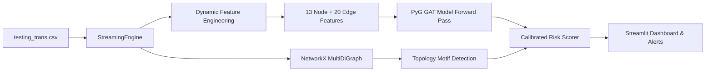

# AML Transaction Monitoring & Graph Prediction Engine 🛡️

An Anti-Money Laundering (AML) transaction monitoring and graph investigation platform powered by **PyTorch Geometric (PyG) Graph Attention Networks (GAT)**, **NetworkX Dynamic Graph Engine**, and an interactive **Streamlit** compliance dashboard.

---

## 📌 Project Overview

Traditional rule-based AML systems struggle to identify complex laundering topologies such as **Fan-Out** (one sender rapidly disbursing funds across multiple accounts) and **Fan-In** schemes in streaming transaction environments.

This system ingests transactions chronologically, incrementally constructs an in-memory directed multigraph, dynamically recomputes node and edge behavioral features on the fly, and performs neural inference using a trained **Graph Attention Network (GAT)** to alert compliance auditors to suspicious money laundering patterns.

> **Note on Terminology**: Per compliance and system architecture guidelines, inference is designated as **Prediction** rather than *Real-Time Prediction*, as the pipeline processes chronological streaming batches without direct live core-banking API hooks.

---

## 📂 Project Directory Structure

```plaintext
Real-streaming_AML/
├── Data/                                    # Streaming and evaluation datasets
│   ├── testing_trans.csv                    # Pristine original streaming transactions
│   ├── testing_accounts.csv                 # Account metadata (Bank, Entity, Name)
│   ├── streaming_predictions_updated.csv    # Separate predictions export (with retroactive fan-out escalation)
│   ├── streaming_predictions_updated.json   # JSON log of updated predictions
│   ├── auditor_decisions.json               # Bank authorizer feedback store
│   └── retraining_history.json              # Historical metrics from overnight retraining
│
├── backend/                                 # ML & Deep Learning models and training pipelines
│   ├── GAT/                                 # Graph Attention Network (PyG) implementation
│   │   ├── Finalgat.ipynb                   # GAT training, validation & threshold analysis
│   │   ├── gat_aml_stage1.pt                # Base trained PyTorch GAT model weights (32,385 params)
│   │   └── gat_aml_retrained.pt             # Fine-tuned checkpoint after overnight human retraining
│   │
│   └── lightgbm/                            # Baseline Tabular + Graph Features model
│       ├── 01_preprocessing.ipynb           # Data cleaning & currency conversions
│       ├── 02_feature_engineering.ipynb     # Graph motif feature extraction (Snap ML GFP)
│       ├── 03_modelling_and_tuning.ipynb    # LightGBM training & hyperparameter tuning
│       ├── aml_lightgbm_model.pkl           # Serialized LightGBM model binary
│       ├── aml_lightgbm_model.txt           # Text-format LightGBM model dump
│       ├── utils.py                         # Helper functions for feature preprocessing
│       ├── requirements.txt                 # LightGBM backend dependencies
│       └── assets/                          # Architecture diagrams and PR curves
│
├── app.py                                   # Streamlit interactive AML compliance dashboard
├── fraud_data.py                            # Dynamic graph engine, GAT prediction & retraining pipeline
├── graph_vis.py                             # Interactive Plotly graph network visualizer
├── stream_engine.py                         # Standalone CLI streaming simulation script
├── backend_api.py                           # REST API endpoints for model inference & alerts
├── verify.py                                # In-memory diagnostic & verification test suite
└── live_stream_state.json                   # State persistence across application restarts
```

---

## 🔍 Detailed Folder & File Breakdown

### 1. `Data/`
Houses the streaming transaction feeds and KYC/entity reference data:
- **`testing_trans.csv`**: Contains chronological transactions with fields including `Timestamp`, `From Bank`, `From Account`, `To Bank`, `To Account`, `Amount Paid`, `Payment Currency`, `Payment Format`, and ground-truth `Is Laundering`.
- **`testing_accounts.csv`**: Reference entity metadata mapping account IDs to bank names (`Global Bank`, `Saudi National Bank`, etc.), bank IDs, entity IDs, and registered customer names.

---

### 2. `backend/`
Contains the machine learning and graph neural network models:

#### `backend/GAT/` (Graph Attention Network)
- **`Finalgat.ipynb`**: End-to-end Jupyter notebook documenting data preparation, edge/node feature scaling, multi-head Graph Attention Network training with `BCEWithLogitsLoss`, threshold analysis, and validation on millions of transactions.
- **`gat_aml_stage1.pt`**: PyTorch checkpoint containing the trained 32,385 weights of the `GAT_AML_Stage1` model used by the real-time engine.

#### `backend/lightgbm/` (Graph Feature Preprocessing + Gradient Boosting)
- **`01_preprocessing.ipynb`**: Converts raw multi-currency transactions to standardized USD amounts and formats.
- **`02_feature_engineering.ipynb`**: Extracts graph topology features (fan-in/fan-out degrees, length-constrained cycle participation, temporal burst metrics).
- **`03_modelling_and_tuning.ipynb`**: Trains a LightGBM classifier optimizing Precision-Recall AUC under severe class imbalance (~1:1000).
- **`aml_lightgbm_model.pkl` / `.txt`**: Trained LightGBM model artifacts deployed in the real-time ensemble inference pipeline.
- **`utils.py`**: Utility methods for memory reduction and batch transformation.
- **`assets/`**: Visualizations of money laundering motifs and PR curves.

---

### 3. Core Engine & Application Files (Root)

| File | Description |
| :--- | :--- |
| **`app.py`** | Modern 5-screen **Streamlit** dashboard: Dashboard overview, Screen 2 Predictions & Feedback loop, Authorizer Decisions audit ledger with "Revise Decision", Overnight Retraining pipeline, and Plotly Graph Network. |
| **`fraud_data.py`** | Dynamic graph engine & GAT prediction pipeline. Maintains in-memory multigraph, calculates 13 node and 20 edge features, performs GAT inference, executes retroactive fan-out escalation, and runs overnight model fine-tuning. |
| **`graph_vis.py`** | **Plotly** graph visualization module. Renders star-topology transaction graphs (central Sender star ★, Hop-1 Receiver circles ●, amount badges, and rich tooltips). |
| **`stream_engine.py`** | Command-line script to test streaming, console logging of GAT inferences, and fan-out detection without launching the UI. |
| **`backend_api.py`** | API service layer providing endpoints for model inference, transaction submission, auditor approvals, and health checks. |
| **`verify.py`** | Comprehensive in-memory verification test suite validating GAT PyG weights, LightGBM model, fan-out pattern recognition, and state persistence. |
| **`live_stream_state.json`** | JSON checkpoint file preserving stream position, active alert counts, timestamps, and auditor decisions across application restarts. |

---

## ⚙️ How the Streaming Prediction Engine Works



1. **Transaction Ingestion**: Each transaction is processed in chronological order.
2. **Dynamic Profiling**: In-memory statistics (in/out counts, amounts, net flow, unique receivers) are updated for both sender and receiver.
3. **Graph Construction**: Directed edges and nodes are added to an in-memory NetworkX multigraph with USD-converted volumes.
4. **Feature Engineering**: 13 node features and 20 edge features (including log amounts, hour $\sin/\cos$, recency, and sender z-scores) are extracted and scaled.
5. **GAT Inference**: Tensors are passed through the PyTorch Geometric GAT model (`gat_aml_stage1.pt` or `gat_aml_retrained.pt`) to compute neural anomaly logits.
6. **Risk Calibration & Alerting**: GAT neural signal is combined with structural graph motif detection (e.g. $\ge 2$ unique receivers = Medium Risk, $\ge 3$ unique receivers = High Risk) to compute an intuitive **0–100 Risk Score**.
7. **Auditor Action & Retraining**: Compliance officers review predictions on Screen 2, approve legitimate transactions or escalate suspicious clusters to SAR, and trigger overnight retraining.

---

## 🚀 Quickstart Guide

### 1. Prerequisites
- Python 3.10+
- PyTorch and PyTorch Geometric compatible with your operating system

### 2. Installation
Clone the repository and install dependencies:
```bash
git clone https://github.com/Pooja52755/Real-streaming_AML.git
cd Real-streaming_AML
pip install -r requirements.txt
```

### 3. Verify Model & Dependencies
Run the verification script to ensure all weights and packages load properly:
```bash
python verify.py
```

### 4. Launch the Dashboard
Start the Streamlit application:
```bash
streamlit run app.py
```
Open your browser at **`http://localhost:8501`**.

---

## 🖥️ Using the Dashboard
The dashboard features 5 navigation views accessible from the sidebar:

1. **`Dashboard`**:
   - **Streaming Controls**: `▶️ Stream Data`, `⏸️ Stop Streaming`, `▶ Step +1`, `⏩ Step +10`, and `⚡ Run All (N)`.
   - **Active Alerts Panel**: All flagged fan-out clusters with risk badges and customer profiles.
   - **Transaction Routing Flow**: Central sender with hop-1 receivers and GAT neural risk levels.

2. **`Screen 2: Predictions & Feedback`**:
   - Full chronological ledger of transactions with GAT probabilities and calibrated risk scores.
   - **Retroactive Fan-Out Escalation**: Prior transactions in a fan-out cluster are retroactively marked as laundering members without modifying `Data/testing_trans.csv`.
   - **Authorizer Decision Form**: Submit compliance verdicts (`✅ Approve` vs `🚫 Confirm Laundering`) with custom notes.
   - **`⚡ Auto-Review 45 Predictions`**: Single-click demo seeding 45 realistic authorizer reviews.

3. **`Authorizer Decisions`**:
   - Filterable ledger of all reviewed transactions and clusters.
   - **`✏️ Revise Decision`**: Revisit any decision to reset verdict, provide updated remarks, and log audit history.

4. **`Overnight Retraining`**:
   - Human-in-the-loop continuous learning pipeline.
   - **`🌙 Run Overnight Retraining Batch`**: Fine-tunes the GAT model on reviewed cases.
   - Displays epoch-by-epoch BCE loss convergence charts and before-vs-after accuracy/precision/recall metrics.

5. **`Graph Network`**:
   - Interactive Plotly money trail visualization (Sender star ★ → Hop-1 Receivers ●).

---

## 📜 License
This project is licensed under the Apache 2.0 / MIT Open Source License.
